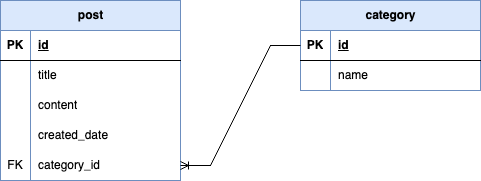
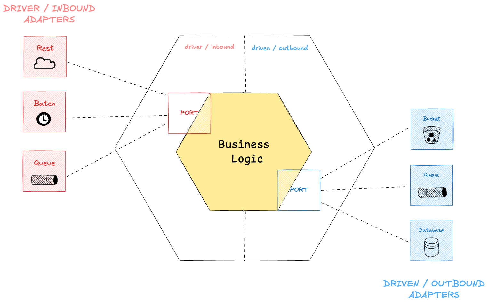

## Blogger Hexagonal 

Building a blogging platform that allows individuals to publish content in the form of posts.

Each Post has a title, content, category, and creation date.

The goal of this repo, is to highlight a real use case of the differences between a traditional layer to hexagonal architecture for a spring boot application. 

* Traditional layer : [`traditional` branch](https://github.com/elieahd/blogger-hexagonal/tree/traditional)
* Hexagonal layer : [`hexagonal` branch](https://github.com/elieahd/blogger-hexagonal/tree/hexagonal)

This is part of an article: [Transforming traditional layered architecture into hexagonal architecture]()

## Pipelines

| Event  | Description      | Workflow                                                                                                                                                                   |
|--------|------------------|----------------------------------------------------------------------------------------------------------------------------------------------------------------------------|
| `push` | Tests and checks |  |
